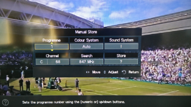

# The MCR (Room)

The MCR is a large room inside the Queens' Building, set aside for
graduates. It is accessible 24 hours a day by swipe card access and
contains a television, newspapers, facilites to make tea/coffee, and a
collection of board games as well as a free pool table.

The MCR is on the first floor of the Queens' Building, opposite the
Lecture Theatre.

## TV troubleshooting

If the TV isn’t connecting to the Sky box, there is a quick fix. First, make sure the sky box is on (hit the `Sky` button)…

Select `menu` on the remote control, then pick `Channels` > `Manual Store` > `Analogue`

Make sure for `Programme 1`, `Channel` is `68.` Go to `Store` and hit `Enter` on the remote. It should look like the image below.

